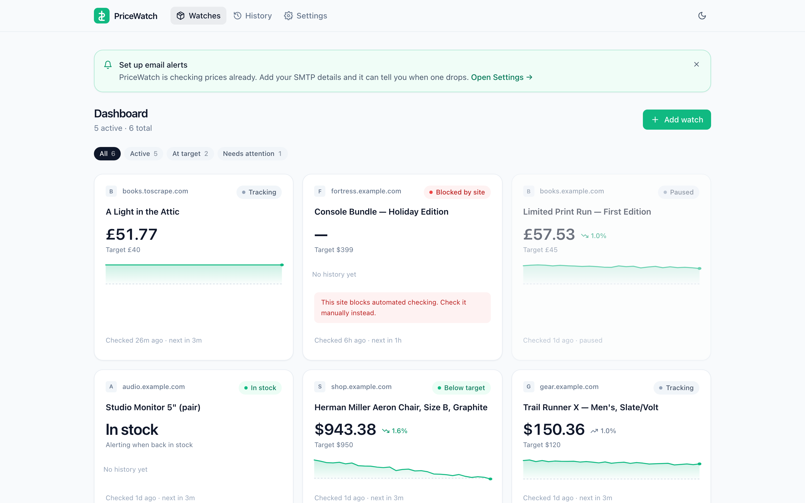

<div align="center">

# PriceWatch

**Watch a price. Get an email when it drops.**
Self-hosted, single file database, no account, no cloud.

[](https://github.com/prashant-cr/PriceWatch/actions/workflows/ci.yml)
[](LICENSE)
[](https://nodejs.org)
[](CONTRIBUTING.md)

[Quickstart](#30-second-quickstart) · [Features](#features) · [FAQ](#faq) · [Contributing](CONTRIBUTING.md)

</div>

---

Paste a product URL. PriceWatch figures out the name and the price by itself, checks
the page on a schedule you choose, and emails you the moment it drops below your
target — or the moment a sold-out item comes back.

Everything runs on your machine. The database is one SQLite file you can back up by
copying it.

<picture>
  <source media="(prefers-color-scheme: dark)" srcset="docs/screenshot-dashboard-dark.png">
  
</picture>

## 30-second quickstart

```bash
npx price-watch
```

That is the whole setup. It downloads Chromium on first run, creates `./data/`, and
prints a URL — open it and add your first watch.

Prefer containers?

```bash
docker compose up
```

Then open <http://localhost:3070>.

Email is the only thing you ever have to configure, and only when you want alerts:
open **Settings**, pick the Gmail or Resend preset, fill in your credentials, and hit
**Send test email**.

## Features

- **Automatic price detection.** JSON-LD `Product`/`Offer` schema first, then
  OpenGraph and `product:price` meta tags, then microdata, then common price
  selectors, then a last-resort scan of the page. The add-watch modal shows you what
  it found so you can confirm it before saving.
- **CSS selector override** for the pages that defeat all of the above.
- **Two alert modes.** "Tell me when it drops below X", or "tell me when it is back in
  stock".
- **Alerts that do not spam.** A price alert fires on the _crossing_ below your
  target, not on every check while it sits there, and re-arms when the price climbs
  back above.
- **Visible schedules.** Every card shows when it was last checked and when it will be
  checked next. A History page logs every single check with its result and duration.
- **Price history charts** per watch, 30 or 90 days, with your target drawn on.
- **Light and dark mode**, follows your system by default. Works on a phone.
- **Pluggable alert channels.** Email ships in the box; Telegram, Discord, Slack and
  ntfy are a single file each — see [CONTRIBUTING.md](CONTRIBUTING.md).

## How checking works

A check runs headless Chromium, waits for the page to settle, reads the DOM, and
records what it found. PriceWatch is a **polite scraper** and is built to stay that
way:

- At most one request at a time per domain, with a minimum 10-second gap between them.
- Watches are jittered so they never all fire on the same second.
- Minimum check interval is 15 minutes. The UI rejects anything faster, including
  custom cron expressions.
- Images, fonts and video are blocked, so a check is cheap for you and for the store.
- Failed checks retry twice with backoff. Three failures in a row gets you one email,
  not one per failure.

## Configuration

Nothing is required. These environment variables exist if you want them:

| Variable              | Default     | Purpose                                         |
| --------------------- | ----------- | ----------------------------------------------- |
| `PORT`                | `3070`      | Port to listen on                               |
| `HOST`                | `127.0.0.1` | Bind address. Docker sets `0.0.0.0`             |
| `PRICEWATCH_DATA_DIR` | `./data`    | Where `pricewatch.db` lives                     |
| `PRICEWATCH_DB`       | —           | Full path to the database file, overrides above |
| `LOG_LEVEL`           | `warn`      | Fastify log level                               |

> PriceWatch binds to loopback by default because it has **no authentication**. If you
> expose it on a network, put it behind a reverse proxy that does.

## FAQ

### Why did my check get blocked?

Some stores actively detect and refuse automated visitors. When that happens
PriceWatch marks the watch **"Blocked by site"** and stops retrying.

It will not work around the block. No CAPTCHA solving, no anti-bot bypass, no
browser-fingerprint spoofing, no proxy rotation. **This is a deliberate, permanent
project policy, and pull requests adding evasion features will be declined.** Circumventing
a site's access controls is the store's decision to make, not ours.

What to do instead: check that page manually, or use the store's own price-alert or
wishlist feature. Plenty of smaller shops — Shopify, WooCommerce, and most
independent stores — work fine.

### It found the wrong number on the page.

Open the watch → **Edit** → **CSS selector override**, and paste a selector that
matches the element holding the price (right-click the price → Inspect). The next
check will use it.

### Can I track Amazon?

Often not — Amazon blocks automated checking, and PriceWatch will tell you so rather
than fight it. Amazon has its own price-watch features. The tool is aimed at the long
tail of ordinary stores.

### Where is my data?

`./data/pricewatch.db`, a single SQLite file. Back it up by copying it. Nothing is
sent anywhere except the page requests themselves and the alert emails you configure.

### Does it need to keep running?

Yes — the scheduler runs in-process. Leave it running (a `systemd` unit,
`docker compose up -d`, or a spare machine) and it will keep checking.

### Can I check more often than every 15 minutes?

No. See [How checking works](#how-checking-works).

## Development

```bash
npm install
npm run dev        # API on :3070, Vite dev server on :5173 with hot reload
npm test           # vitest
npm run lint       # eslint + prettier
npm run typecheck  # tsc
npm run build      # production build into dist/
```

Then open <http://localhost:5173>.

See [CONTRIBUTING.md](CONTRIBUTING.md) for the code layout and how to add an alert
channel.

## License

MIT — see [LICENSE](LICENSE).
